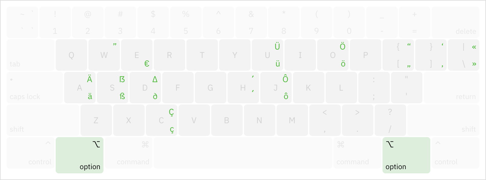

# DeUs-Layout

**in English** • [auf Deutsch](README.de.md)

> A US-layout-based keyboard layout for German.  
> **Only macOS is supported now.**

If you come to Germany from a country, where the primary latin keyboard layout is a version of an English layout (e.g., US Intl. or UK), you know the pain of trying to use the infamous ‘T1-Belegung’. Shifted parentheses, Y-Z swap, weird placement of brackets. It becomes a nightmare, when you try to write code on these.

DeUs-Layout is my solution — it's the US Layout with replaced symbols, relevant to Germans and Germany residents (such as umlauts, Eszett and Euro sign).

## Changes compared to English (US) layout

- German-related
  - German umlauts (äöü) can be typed using (<kbd>⇧ Shift</kbd>+)<kbd>⌥ Option</kbd>+<kbd>a</kbd>/<kbd>o</kbd>/<kbd>u</kbd>
  - Eszett (ß) is left at <kbd>⌥ Option</kbd>+<kbd>s</kbd>, but its capital version (ẞ) is now at <kbd>⇧ Shift</kbd>+<kbd>⌥ Option</kbd>+<kbd>s</kbd>
  - Euro sign (€) is now at <kbd>⌥ Option</kbd>+<kbd>e</kbd>
  - acute accent (´) moved to <kbd>⌥ Option</kbd>+<kbd>h</kbd>
  - opening and closing quotation marks swapped to match the German rules
    - accesible at (<kbd>⇧ Shift</kbd>+)<kbd>⌥ Option</kbd>+<kbd>\[</kbd>/<kbd>\]</kbd>/<kbd>\\</kbd>
- Consistency-related
  - Capital delta (∆) moved to <kbd>⇧ Shift</kbd>+<kbd>⌥ Option</kbd>+<kbd>d</kbd>
  - Lowercase O with circumflex (ô) was added to <kbd>⌥ Option</kbd>+<kbd>j</kbd>

## Install

1. Download the ZIP archive from [the latest release page](https://github.com/NickKaramoff/DeUs-Layout/releases/latest).
2. Unzip the file.
3. Go to `mac` folder and execute `install`, either by double-clicking it or by running `./mac/install` in Terminal
   - alternatively, take the file `mac/DeUs-Layout.bundle` and put it in `/Library/Keyboard Layouts`.
4. Select the new layout in the settings. It is under "German" category and is called "German (DeUs)".
   - depending on your OS locale, it may be called "DeUs, deutsch" or "Немецкий (DeUs)".
5. You can remove your old English/German layout now if you will. If the button is greyed out, try to add a Japanese layout, remove the English/German layout, and then remove the Japanese one.
6. Log out and log back in for good measure.

## Credits

Inspired by [@tonsky](https://twitter.com/nikitonsky)'s [Universal-Layout](https://github.com/tonsky/Universal-Layout/). I am also using modified build scripts of his.

The keyboard layout was done with help of [Ukelele](http://software.sil.org/ukelele/).

## Licence

[BSD-3-Clause](https://spdx.org/licenses/BSD-3-Clause.html) © 2019-2021 Nikita Karamov
